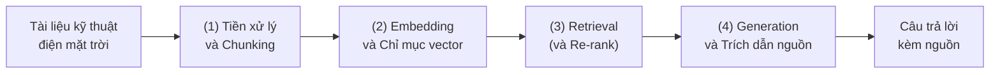

> 📖 **Bản đọc thử** — gom các phần đã sửa thành một mạch bài báo (dạng LaTeX/IEEE), tiếng Việt, để bạn đọc kiểm tra dòng chảy lập luận. Công thức viết bằng MathJax (Obsidian render được).
> ⚠️ Đây **chưa phải bản nộp**: phần **Kết quả để trống** (chờ team chạy), và chỗ cấu hình hệ thống là `[team chốt]`. Nhãn trạng thái: **[Proposed]** đề xuất · **[Plan]** kế hoạch đo · **[Result]** số liệu thật.
> Nguồn nội dung: [[Design & Evaluation Protocol - v2]] · [[Related Work - Draft v1 (VN)]] · [[Paper Outline - Smart Solar Capstone]].

---

# Trợ lý tri thức dựa trên RAG tùy biến theo miền cho vận hành và bảo trì điện mặt trời: Thiết kế và đánh giá reference-free

**Nhóm Capstone 2026**
**1.** [Họ và tên — bổ sung] — SE180466
**2.** [Họ và tên — bổ sung] — SE180579
**3.** [Họ và tên — bổ sung] — SE184144
**4.** [Họ và tên — bổ sung] — SE180271
Khoa Kỹ thuật Phần mềm, Đại học FPT, Việt Nam
Email liên hệ: [bổ sung]

*Bản thảo — 2026*

---

## Tóm tắt (Abstract) — *[Proposed/Plan]*

Các trợ lý hỏi–đáp dùng mô hình ngôn ngữ lớn (LLM) trả lời trôi chảy nhưng dễ đưa ra thông tin không được nguồn hỗ trợ (*hallucination*) và khó truy vết về tài liệu gốc — rủi ro lớn trong miền kỹ thuật như lắp đặt, vận hành và bảo trì (O&M) điện mặt trời. Truy hồi tăng cường sinh (Retrieval-Augmented Generation — RAG) được kỳ vọng giảm các vấn đề này, nhưng *mức cải thiện thực tế* của một pipeline RAG **tùy biến theo tài liệu dự án** so với LLM thường và RAG mặc định trên dữ liệu O&M điện mặt trời vẫn chưa được định lượng rõ. Bài báo này **đề xuất thiết kế** một pipeline RAG tùy biến cho miền điện mặt trời và **một giao thức đánh giá reference-free** dựa trên RAGAS, so sánh có kiểm soát với hai baseline (plain LLM và naive RAG) theo *faithfulness, answer relevancy, context precision*, cùng *độ trễ* và *chi phí*. ⚠️ *Kết quả thực nghiệm sẽ được bổ sung sau khi hoàn tất chạy hệ thống; bản thảo này tập trung vào thiết kế và giao thức.*

**Từ khóa:** Retrieval-Augmented Generation; đánh giá RAG; faithfulness; điện mặt trời; hỏi–đáp miền hẹp.

**Abstract (English).** Large language model (LLM) assistants produce fluent answers but are prone to unsupported claims (*hallucination*) and weak source traceability — a serious risk in technical domains such as solar photovoltaic installation, operation and maintenance (O&M). Retrieval-Augmented Generation (RAG) is expected to mitigate these issues, yet the *actual improvement* of a RAG pipeline **customized to project documents**, compared with a plain LLM and a default RAG on solar O&M data, remains insufficiently quantified. This paper **proposes the design** of a domain-customized RAG pipeline for the solar-energy domain and a **reference-free evaluation protocol** based on RAGAS, with a controlled comparison against two baselines (plain LLM and naive RAG) in terms of *faithfulness, answer relevancy, and context precision*, together with *latency* and *cost*. ⚠️ *Experimental results will be added after the system runs are completed; this draft focuses on the design and the protocol.*

**Keywords:** Retrieval-Augmented Generation; RAG evaluation; faithfulness; solar energy; domain-specific question answering.

---

## 1. Giới thiệu (Introduction)

Số hóa ngành điện mặt trời đang tăng nhanh, kéo theo nhu cầu về các nền tảng phần mềm hỗ trợ lắp đặt–giám sát–bảo trì (Depex Technologies, 2025).¹ Tài liệu O&M (sổ tay kỹ thuật, hướng dẫn lắp đặt, quy trình bảo trì) thường dài và phân mảnh, khiến kỹ thuật viên khó tra cứu nhanh. LLM có thể tổng hợp câu trả lời tức thì, nhưng trong ngữ cảnh kỹ thuật, **một câu trả lời sai hoặc không truy được nguồn có thể dẫn tới thao tác sai**, gây rủi ro an toàn và chi phí.

RAG (Lewis et al., 2020) giảm thiểu các điểm yếu cốt lõi của LLM — hallucination, tri thức lỗi thời, và suy luận thiếu minh bạch (Gao et al., 2024) — bằng cách ghép **bộ nhớ tham số** (trọng số mô hình) với **bộ nhớ phi tham số** (chỉ mục tài liệu cập nhật được). Tuy nhiên, chất lượng RAG phụ thuộc mạnh vào lựa chọn *chunking*, *embedding* và *retrieval* (Karpukhin et al., 2020; Shaukat et al., 2026), và **không có cấu hình mặc định nào tối ưu cho mọi miền** (Shaukat et al., 2026). Câu hỏi đặt ra: với tài liệu O&M điện mặt trời, một pipeline RAG **được tùy biến** cải thiện bao nhiêu so với cách dùng LLM thường hoặc RAG mặc định?

**Đóng góp của bài báo:**
- **C1 [Proposed].** Thiết kế một pipeline RAG tùy biến cho miền O&M điện mặt trời, với khái niệm "tùy biến" được định nghĩa cụ thể (Mục 4).
- **C2 [Plan→Result].** Một giao thức đánh giá reference-free so sánh pipeline với hai baseline có kiểm soát (plain LLM, naive RAG) theo các tiêu chí đo được (Mục 5).
- **C3 (tùy chọn) [Result].** Một test set hỏi–đáp miền điện mặt trời (ưu tiên tiếng Việt) làm tài nguyên đánh giá.

> ¹ Lưu ý: Depex Technologies (2025) là tài liệu ngành **không bình duyệt**; chỉ dùng làm bối cảnh, không làm luận cứ định lượng (sẽ thay bằng báo cáo thị trường gốc ở bản nộp).

---

## 2. Công trình liên quan (Related Work)

**Nền tảng RAG.** RAG được Lewis et al. (2020) giới thiệu; xương sống truy hồi dựa trên Dense Passage Retrieval (DPR) (Karpukhin et al., 2020), với dual-encoder vượt BM25 **9–19% tuyệt đối** ở top-20 retrieval accuracy. Survey của Gao et al. (2024) hệ thống hóa lĩnh vực theo tiến trình *Naive → Advanced → Modular RAG* — khung để định vị pipeline của chúng tôi (nhóm Advanced/Modular).

**Chunking & embedding.** Chất lượng truy hồi phụ thuộc cách tách tài liệu: Shaukat et al. (2026) khảo sát 36 phương pháp trên 6 miền × 5 embedding model, cho thấy *content-aware chunking* (Paragraph Group, nDCG@5 ≈ **0.459**) vượt xa tách ký tự cố định (nDCG@5 **< 0.244**), và chiến lược tối ưu **phụ thuộc miền** — cơ sở để tùy biến trên tài liệu dự án thay vì dùng mặc định.

**Xếp hạng hiệu quả & truy hồi tiếng Việt.** Ở tầng xếp hạng, ColBERT (Khattab and Zaharia, 2020) đề xuất *late interaction*: mã hóa độc lập câu hỏi và tài liệu bằng BERT rồi so khớp token mịn (MaxSim), cho phép tiền-tính biểu diễn tài liệu offline — hiệu quả cạnh tranh các mô hình dựa trên BERT nhưng **nhanh hơn hai bậc độ lớn và dùng ít hơn bốn bậc độ lớn FLOPs mỗi truy vấn**, một cơ chế re-rank khả thi cho pipeline tùy chỉnh. Với corpus **tiếng Việt**, Nguyen Ba et al. (2024) xử lý các thách thức đặc thù (token quá dài, ensemble thiếu ổn định, thứ tự tài liệu tham chiếu bị bỏ qua) bằng tiền xử lý dữ liệu, **Reciprocal Rank Fusion chuẩn hóa thứ tự** (ghép keyword + vector) và **re-rank bằng Active Retrieval** — tham chiếu kỹ thuật sát nếu tài liệu O&M của dự án bằng tiếng Việt.

**Đánh giá truy hồi trên tài liệu kỹ thuật & câu hỏi đa đoạn.** Hai benchmark gần đây làm rõ độ khó đúng bối cảnh đề tài: FreshStack (Thakur et al., 2025) dựng benchmark truy hồi *thực tế, không nhiễm dữ liệu* trên tài liệu kỹ thuật/mã nguồn và cho thấy các retriever hiện tại **kém xa phương pháp oracle trên cả năm chủ đề**; MultiHop-RAG (Tang and Yang, 2024) chỉ ra **các hệ RAG hiện tại trả lời chưa thỏa đáng các câu hỏi đa đoạn** cần ghép nhiều mảnh bằng chứng. Hai kết quả này thúc đẩy việc phân loại câu hỏi *factoid / quy trình / đa-đoạn* trong test set của chúng tôi (Mục 5.1) và đặt kỳ vọng thực tế cho retriever trên tài liệu O&M dài, chuyên ngành.

**RAG nâng cao (để định vị, không chạy đối chứng).** Các kiến trúc self-reflective/self-correcting như Self-RAG (Asai et al., 2023) (reflection token, tự phê bình) và Corrective RAG (Yan et al., 2024) (đánh giá chất lượng truy hồi) cải thiện độ tin cậy; GraphRAG (Edge et al., 2024) và RAPTOR (Sarthi et al., 2024) (cây tóm tắt đệ quy, +20% absolute trên QuALITY khi ghép GPT-4) xử lý tài liệu dài/câu hỏi tổng hợp. Trong bài này, các kiến trúc trên được **thảo luận để định vị đóng góp, không dùng làm baseline đối chứng** (xem Mục 4).

**Đánh giá RAG.** RAGAS (Es et al., 2024) cung cấp bộ đo **reference-free** (không cần ground-truth) trên ba trục: chất lượng ngữ cảnh, độ trung thực phần sinh (*faithfulness*), và độ liên quan câu trả lời — ánh xạ trực tiếp vào tiêu chí của chúng tôi; nhóm tác giả mô tả đây là *"a framework for reference-free evaluation … without relying on ground truth human annotations"*. Trên bộ WikiEval của chính nhóm tác giả, RAGAS đồng thuận với người đánh giá **0.95** ở *faithfulness*, **0.78** ở *answer relevance* nhưng chỉ **0.70** ở *context relevance* — chiều được chính các tác giả nhận là khó đánh giá nhất (Es et al., 2024). Vì RAGAS dựa trên **LLM-as-judge**, độ tin cậy của nó chịu các thiên kiến mà Li, D. et al. (2024) hệ thống hóa (khung *what / how to judge, how to benchmark*) — lý do chúng tôi bổ sung kiểm thủ công mẫu nhỏ (Mục 7). Các framework bổ trợ mở rộng khả năng đo: RAGBench (Friel et al., 2024) (**100k** ví dụ, **năm** miền công nghiệp; một encoder fine-tuned **vượt** các phương pháp LLM-judge — riêng trên miền kỹ thuật TechQA, AUROC phát hiện hallucination của GPT-3.5/RAGAS chỉ **0.51–0.52**, gần ngẫu nhiên, so với **0.86** của DeBERTa fine-tuned) và RAGTruth (Niu et al., 2024) (**~18.000** câu trả lời gán nhãn hallucination **ở mức từ**); ở tầm hệ thống, Zhou et al. (2024) đề xuất khung **Trust-RAG Compass** với **sáu chiều** *factuality, robustness, fairness, transparency, accountability, privacy* để trình bày độ tin cậy/truy vết trong phần Thảo luận. Cơ sở lý thuyết về hallucination lấy từ survey của Ji et al. (2023) (phân biệt *intrinsic* vs *extrinsic*).

**Truy vết nguồn.** Bohnet et al. (2022) hình thức hóa *Attributed QA* và metric AIS (*Attributable to Identified Sources*); ngay hệ retrieve-then-read tốt nhất chỉ đạt **65.5±1.5% AIS**, và nhấn mạnh *correctness ≠ attribution*.

**Khoảng trống.** Các công trình trên xử lý chất lượng RAG, hiệu quả truy hồi (Karpukhin et al., 2020; Khattab and Zaharia, 2020), đánh giá (Es et al., 2024; Friel et al., 2024; Li, D. et al., 2024; Niu et al., 2024) và benchmark trên tài liệu kỹ thuật/đa đoạn (Thakur et al., 2025; Tang and Yang, 2024) một cách **tổng quát**, trong khi so sánh RAG với long-context LLM cho thấy ưu thế **chi phí** rõ rệt của RAG (Li, Z. et al., 2024); song chưa có nghiên cứu **tùy biến RAG theo tài liệu O&M điện mặt trời (ưu tiên tiếng Việt)** kèm **đánh giá định lượng reference-free** so với baseline có kiểm soát trên dữ liệu miền này. Đây là khoảng trống bài báo hướng tới.

> 📑 **Ghi chú kiểm chứng nguồn.** Các con số/claim định lượng trong mục Công trình liên quan đã được **đối chiếu nguyên văn với nguồn gốc** (grounded qua NotebookLM trên 35 nguồn, 2026-06-30): DPR 9–19% (Karpukhin et al., 2020), chunking 0.459/<0.244 (Shaukat et al., 2026), RAPTOR +20% *chỉ khi ghép GPT-4* (Sarthi et al., 2024), ColBERT nhanh 2 bậc/ít FLOPs 4 bậc (Khattab and Zaharia, 2020), RRF+Active Retrieval (Nguyen Ba et al., 2024), FreshStack (Thakur et al., 2025), MultiHop-RAG (Tang and Yang, 2024), RAGBench 100k/RoBERTa>LLM-judge (Friel et al., 2024), RAGTruth ~18k mức từ (Niu et al., 2024), RAGAS reference-free (Es et al., 2024), Trust-RAG 6 chiều (Zhou et al., 2024), RAG rẻ hơn LC (Li, Z. et al., 2024), LLM-as-judge (Li, D. et al., 2024). **Đã phủ nốt bằng full-text (Chrome trực tiếp trên arXiv HTML/ar5iv, 2026-07-05)**: AIS 65.5±1.5 cho retrieve-then-read tốt nhất + tương quan EM–AIS chỉ 0.45 tức *correctness ≠ attribution* (Bohnet et al., 2022); TRACe = uTilization, Relevance, Adherence, Completeness (Friel et al., 2024, §3.2); công thức 3 metric RAGAS F=|V|/|S|, AR=(1/n)Σsim(q,qᵢ), CR=|câu trích|/|tổng câu| (Es et al., 2024, bản arXiv:2309.15217). **Bổ sung (grounded NotebookLM full-text, 2026-07-05)**: RAGAS–người đồng thuận 0.95/0.78/0.70 trên WikiEval (Es et al., 2024, Table 1); TechQA AUROC GPT-3.5/RAGAS = 0.51/0.52 vs DeBERTa 0.86 (Friel et al., 2024, Table 3). Chi tiết: [[Verify Log - NotebookLM (2026-06-29)]] · [[Related Work - Draft v1 (VN)]].

---

## 3. Phát biểu bài toán & Câu hỏi nghiên cứu (Problem Statement & Research Questions)

**Bài toán.** Cho corpus tài liệu O&M điện mặt trời $D$ và một câu hỏi $q$, cần sinh câu trả lời $a$ vừa *đúng*, vừa *trung thực với tài liệu* (mọi khẳng định được $D$ hỗ trợ), vừa *truy được nguồn*, trong giới hạn chi phí và độ trễ chấp nhận được.

**Câu hỏi nghiên cứu (RQ).** *So với (i) plain LLM (không truy hồi) và (ii) naive RAG (chunk cố định, không rerank), một pipeline RAG tùy biến theo tài liệu O&M điện mặt trời cải thiện faithfulness, answer relevancy và context precision (đo bằng RAGAS — Es et al., 2024) đến mức nào, và đánh đổi độ trễ/chi phí ra sao?*

**Sub-RQ (tùy chọn).** Pipeline tùy biến đạt mức *source traceability* nào (đo định tính trên tập nhỏ, khung AIS — Bohnet et al., 2022)?

---

## 4. Thiết kế hệ thống & Phương pháp (System Design & Methodology) *[Proposed]*

### 4.1 Kiến trúc tổng thể

Pipeline gồm bốn khối: (1) tiền xử lý & *chunking* tài liệu; (2) *embedding* + chỉ mục vector; (3) *retrieval* (+ re-rank); (4) *generation* có kèm trích dẫn nguồn. Hình 1 minh hoạ luồng tổng thể.

**Hình 1.** Kiến trúc tổng thể pipeline RAG bốn khối (đề xuất).

Cấu hình cụ thể được liệt kê ở **Bảng 1**, hiện để **placeholder** — team chốt trước khi chạy:

**Bảng 1.** Cấu hình các thành phần hệ thống (đề xuất; sẽ chốt trước khi chạy).

| Thành phần | Lựa chọn | Trạng thái |
|---|---|---|
| Embedding model | `[team chốt — model đa ngữ hỗ trợ tiếng Việt]` | ⚠️ chưa chốt |
| Vector database | `[team chốt]` | ⚠️ chưa chốt |
| LLM sinh | `[team chốt — open hay API]` | ⚠️ chưa chốt |
| Re-ranker | `[team chốt / hoặc bỏ]` | ⚠️ chưa chốt |
| Corpus | `[team chốt — số trang, ngôn ngữ]` | ⚠️ chưa chốt |

### 4.2 Định nghĩa "tùy biến" (custom)

Trong bài, **"tùy biến" (custom)** nghĩa là **điều chỉnh pipeline RAG theo miền** (chunking, retrieval, prompt, trích dẫn); **không** phải *fine-tuning trọng số* mô hình ngôn ngữ. Cụ thể, "Custom RAG" = naive RAG **cộng** các thay đổi ở **Bảng 2**, mỗi thay đổi truy nguồn được về tài liệu:

**Bảng 2.** Đối chiếu Naive RAG (B1) và Custom RAG (P) kèm căn cứ tham chiếu.

| Thành phần | Naive (baseline B1) | Custom (P) | Căn cứ |
|---|---|---|---|
| Chunking | Cố định ~512 token | Content-aware (theo cấu trúc) | Shaukat et al. (2026) |
| Retrieval | Vector top-$k$ | Vector + re-rank (±hybrid keyword) | Karpukhin et al. (2020); Khattab and Zaharia (2020); Nguyen Ba et al. (2024) |
| Prompt | Chung | Theo miền O&M điện mặt trời | Gao et al. (2024) |
| Trích dẫn | Không | Trả về nguồn kèm câu trả lời | Lewis et al. (2020); Bohnet et al. (2022) |

### 4.3 Các nhánh so sánh

Giữ **cố định** mọi yếu tố khác (LLM, corpus, test set, top-$k$ cuối) để so sánh công bằng:
- **B0 — Plain LLM:** trả lời trực tiếp, không truy hồi.
- **B1 — Naive RAG:** chunk cố định 512, vector top-$k$, không rerank, prompt chung.
- **P — Custom RAG:** áp dụng các thay đổi ở §4.2.

---

## 5. Thiết lập đánh giá (Evaluation Setup) *[Plan]*

### 5.1 Test set (điều kiện tiên quyết)

50–100 cặp hỏi–đáp trích từ corpus O&M ([team chốt nguồn]); câu trả lời chuẩn (*gold*) do ≥2 thành viên soạn độc lập rồi đối chiếu, kèm **đoạn nguồn** chứa đáp án. Phân loại: factoid / quy trình / đa-đoạn. Đây là **dữ liệu thật**, không sinh tự động.

### 5.2 Độ đo (Metrics)

Ký hiệu: $q$ — câu hỏi; $a$ — câu trả lời sinh ra; $C=\{c_1,\dots,c_k\}$ — tập ngữ cảnh truy hồi.

**Faithfulness** — tỉ lệ khẳng định trong $a$ được $C$ hỗ trợ (chống hallucination):

$$
\mathrm{Faithfulness} = \frac{\big|\{\text{claim} \in a : \text{được } C \text{ hỗ trợ}\}\big|}{\big|\{\text{claim} \in a\}\big|} \tag{1}
$$

**Answer Relevancy** — độ liên quan của $a$ với $q$, ước lượng qua $n$ câu hỏi suy ngược $q_i$ sinh từ $a$:

$$
\mathrm{AnswerRelevancy} = \frac{1}{n}\sum_{i=1}^{n} \cos\!\big(\mathbf{e}_{q},\, \mathbf{e}_{q_i}\big) \tag{2}
$$

**Context Precision@k** — mức độ các đoạn *liên quan* được xếp hạng cao trong $C$:

$$
\mathrm{ContextPrecision@}k = \frac{\sum_{j=1}^{k}\big(\mathrm{Precision@}j \cdot \mathrm{rel}_j\big)}{\big|\{\text{đoạn liên quan trong top-}k\}\big|} \tag{3}
$$

**Độ trễ** báo cáo theo phân vị: $\mathrm{Latency}_{p50},\ \mathrm{Latency}_{p95}$.

**Chi phí** ước tính theo token:

$$
\mathrm{Cost} = \sum_{i} \big(\mathrm{tokens}_i \times \mathrm{price}_i\big) \tag{4}
$$

> ⚠️ Đã đối chiếu **full-text** RAGAS (Es et al., 2024; bản arXiv:2309.15217, kiểm 2026-07-05): công thức (1) và (2) **khớp nguyên văn** bài gốc ($F=|V|/|S|$; $\mathrm{AR}=\frac{1}{n}\sum \mathrm{sim}(q,q_i)$). Lưu ý: metric thứ ba trong bài gốc là **context relevance** ($\mathrm{CR}=$ số câu được trích/tổng số câu trong $c(q)$); còn **Context Precision@k** ở công thức (3) là metric của **thư viện RAGAS** — khi báo cáo phải ghi rõ **phiên bản thư viện** và **model làm "judge"**. RAGAS là bộ đo **reference-free, không cần ground-truth** và dựa trên **LLM-as-judge** — nên có thiên kiến, giảm thiểu bằng kiểm thủ công mẫu nhỏ (Li, D. et al., 2024) (xem [[Verify Log - NotebookLM (2026-06-29)]]). *Source traceability* (sub-RQ) đo định tính theo khung AIS (Bohnet et al., 2022) trên tập nhỏ.

### 5.3 Quy trình

Chạy B0, B1, P trên cùng test set → thu metric §5.2 → báo cáo **trung bình ± độ lệch**; nếu đủ mẫu, kiểm định ý nghĩa (paired test). Cố định seed/nhiệt độ, ghi phiên bản thư viện và log prompt để tái lập.

---

## 6. Kết quả và Thảo luận (Results & Discussion) *[Result]*

> ⚠️ **Để trống có chủ đích.** Không điền số liệu trước khi team chạy thật — bịa số liệu là gian lận nghiên cứu. **Bảng 3** chỉ là khung sẽ điền:

**Bảng 3.** Khung kết quả so sánh ba nhánh (số liệu sẽ do team điền sau khi chạy).

| Nhánh | Faithfulness | Answer Rel. | Context Prec. | Latency p95 | Cost/query |
|---|---|---|---|---|---|
| B0 — Plain LLM | — | — | — | — | — |
| B1 — Naive RAG | — | — | — | — | — |
| P — Custom RAG | — | — | — | — | — |

*Thảo luận sẽ phân tích: (a) custom có cải thiện faithfulness/relevancy so với B0/B1 không; (b) đánh đổi latency/cost; (c) phân tích lỗi retriever vs generator (tùy chọn, dùng RAGChecker — Ru et al., 2024).*

---

## 7. Hạn chế (Limitations)

- Test set nhỏ ($N=50$–$100$), một miền, ưu tiên tiếng Việt → **không khái quát hóa** rộng.
- Chỉ 2 baseline có kiểm soát; chưa đối chứng kiến trúc self-correcting (Self-RAG/CRAG) → *future work*.
- Một cấu hình "custom" duy nhất; chưa *ablation* từng thành phần.
- Đánh giá phụ thuộc LLM-as-judge của RAGAS → có thiên lệch (xem khảo sát của Li, D. et al., 2024); đồng thuận với người thấp nhất ở *context relevance* (0.70 trên WikiEval — Es et al., 2024), và LLM-judge phát hiện hallucination **gần mức ngẫu nhiên trên tài liệu kỹ thuật** (TechQA: AUROC 0.51–0.52 — Friel et al., 2024) — sát với miền O&M của chúng tôi; giảm thiểu bằng kiểm thủ công mẫu nhỏ.
- Truy vết nguồn đo định tính, tập nhỏ.

---

## 8. Kết luận và Hướng phát triển (Conclusion)

Bài báo **đề xuất thiết kế** một pipeline RAG tùy biến cho miền O&M điện mặt trời và **một giao thức đánh giá reference-free** so với hai baseline có kiểm soát (plain LLM, naive RAG) theo faithfulness, answer relevancy, context precision, cùng độ trễ và chi phí. *[Khi có kết quả:]* trên test set $N=\dots$, pipeline cho thấy *[xu hướng]* với đánh đổi *[latency/cost]*. Chúng tôi **chưa khẳng định** ưu thế tổng quát; đánh giá với nhiều baseline, tập lớn hơn và đa miền là hướng tiếp theo. Module phát hiện lỗi tấm pin bằng thị giác máy tính (YOLOv8) được phát triển song song như một hướng mở rộng, ngoài phạm vi bài báo này.

---

## Tài liệu tham khảo (References) — chuẩn Harvard

> Trích dẫn trong bài theo **(Tác giả, Năm)**. Danh mục dưới đây **xếp abc theo họ tác giả** và chỉ gồm các nguồn **được cite trong bài** (đúng thông lệ học thuật). Danh mục Harvard **đầy đủ 34 nguồn** (kèm bảng khoá in-text): [[References (Harvard) - Smart Solar (34 nguồn)]].
> Quy ước: **trích dẫn in-text** — 1–2 tác giả nêu đủ, **≥3 dùng *et al.***; **danh mục** — liệt kê đủ đến 3 tác giả, **≥4 dùng *et al.*** Ngày truy cập URL: 30/6/2026.

Asai, A. et al. (2023) 'Self-RAG: learning to retrieve, generate, and critique through self-reflection'. arXiv:2310.11511 (presented at ICLR 2024). Available at: https://arxiv.org/abs/2310.11511 (Accessed: 30 June 2026).

Bohnet, B. et al. (2022) 'Attributed question answering: evaluation and modeling for attributed large language models'. arXiv:2212.08037. Available at: https://arxiv.org/abs/2212.08037 (Accessed: 30 June 2026).

Depex Technologies (2025) *Solar energy management software solutions: a complete guide*. Available at: https://depextechnologies.com/blog/solar-energy-management-software-solutions-a-complete-guide (Accessed: 30 June 2026).

Edge, D. et al. (2024) 'From local to global: a Graph RAG approach to query-focused summarization'. arXiv:2404.16130. Available at: https://arxiv.org/abs/2404.16130 (Accessed: 30 June 2026).

Es, S. et al. (2024) 'RAGAs: automated evaluation of retrieval augmented generation', *Proceedings of the 18th Conference of the European Chapter of the Association for Computational Linguistics: System Demonstrations*, pp. 150–158. Available at: https://aclanthology.org/2024.eacl-demo.16 (Accessed: 30 June 2026).

Friel, R., Belyi, M. and Sanyal, A. (2024) 'RAGBench: explainable benchmark for retrieval-augmented generation systems'. arXiv:2407.11005. Available at: https://arxiv.org/abs/2407.11005 (Accessed: 30 June 2026).

Gao, Y. et al. (2024) 'Retrieval-augmented generation for large language models: a survey'. arXiv:2312.10997. Available at: https://arxiv.org/abs/2312.10997 (Accessed: 30 June 2026).

Ji, Z. et al. (2023) 'Survey of hallucination in natural language generation', *ACM Computing Surveys*, 55(12), article 248, pp. 1–38. doi: 10.1145/3571730.

Karpukhin, V. et al. (2020) 'Dense passage retrieval for open-domain question answering', *Proceedings of the 2020 Conference on Empirical Methods in Natural Language Processing (EMNLP)*, pp. 6769–6781. Available at: https://aclanthology.org/2020.emnlp-main.550 (Accessed: 30 June 2026).

Khattab, O. and Zaharia, M. (2020) 'ColBERT: efficient and effective passage search via contextualized late interaction over BERT', *Proceedings of the 43rd International ACM SIGIR Conference on Research and Development in Information Retrieval*. arXiv:2004.12832. Available at: https://arxiv.org/abs/2004.12832 (Accessed: 30 June 2026).

Lewis, P. et al. (2020) 'Retrieval-augmented generation for knowledge-intensive NLP tasks', *Advances in Neural Information Processing Systems (NeurIPS)*, 33. arXiv:2005.11401. Available at: https://arxiv.org/abs/2005.11401 (Accessed: 30 June 2026).

Li, D. et al. (2024) 'From generation to judgment: opportunities and challenges of LLM-as-a-judge'. arXiv:2411.16594 (EMNLP 2025). Available at: https://arxiv.org/abs/2411.16594 (Accessed: 30 June 2026).

Li, Z. et al. (2024) 'Retrieval augmented generation or long-context LLMs? A comprehensive study and hybrid approach', *Proceedings of EMNLP 2024 (Industry Track)*. arXiv:2407.16833. Available at: https://arxiv.org/abs/2407.16833 (Accessed: 30 June 2026).

Nguyen Ba, T. et al. (2024) 'Vietnamese legal information retrieval in question-answering system'. arXiv:2409.13699. Available at: https://arxiv.org/abs/2409.13699 (Accessed: 30 June 2026).

Niu, C. et al. (2024) 'RAGTruth: a hallucination corpus for developing trustworthy retrieval-augmented language models', *Proceedings of ACL 2024*. arXiv:2401.00396. Available at: https://arxiv.org/abs/2401.00396 (Accessed: 30 June 2026).

Ru, D. et al. (2024) 'RAGChecker: a fine-grained framework for diagnosing retrieval-augmented generation', *Advances in Neural Information Processing Systems (NeurIPS)*. arXiv:2408.08067. Available at: https://arxiv.org/abs/2408.08067 (Accessed: 30 June 2026).

Sarthi, P. et al. (2024) 'RAPTOR: recursive abstractive processing for tree-organized retrieval'. arXiv:2401.18059 (presented at ICLR 2024). Available at: https://arxiv.org/abs/2401.18059 (Accessed: 30 June 2026).

Shaukat, M.A., Adnan, M. and Kuhn, C.C.N. (2026) 'A systematic investigation of document chunking strategies and embedding sensitivity'. arXiv:2603.06976. Available at: https://arxiv.org/abs/2603.06976 (Accessed: 30 June 2026).

Tang, Y. and Yang, Y. (2024) 'MultiHop-RAG: benchmarking retrieval-augmented generation for multi-hop queries'. arXiv:2401.15391. Available at: https://arxiv.org/abs/2401.15391 (Accessed: 30 June 2026).

Thakur, N. et al. (2025) 'FreshStack: building realistic benchmarks for evaluating retrieval on technical documents'. arXiv:2504.13128. Available at: https://arxiv.org/abs/2504.13128 (Accessed: 30 June 2026).

Yan, S.-Q. et al. (2024) 'Corrective retrieval augmented generation'. arXiv:2401.15884. Available at: https://arxiv.org/abs/2401.15884 (Accessed: 30 June 2026).

Zhou, Y. et al. (2024) 'Trustworthiness in retrieval-augmented generation systems: a survey'. arXiv:2409.10102. Available at: https://arxiv.org/abs/2409.10102 (Accessed: 30 June 2026).
